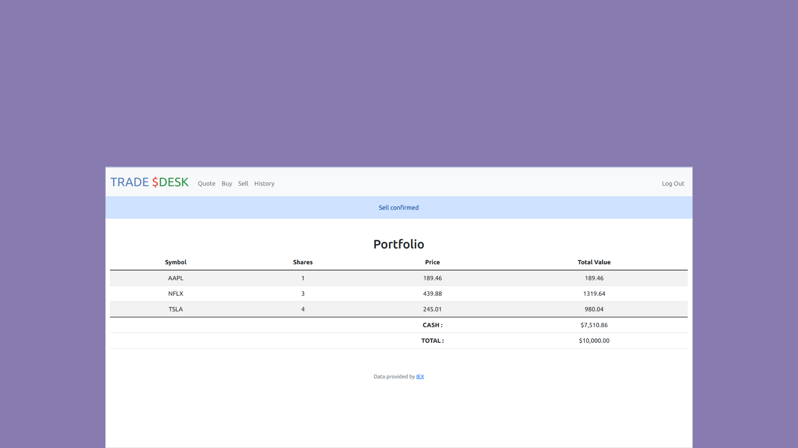
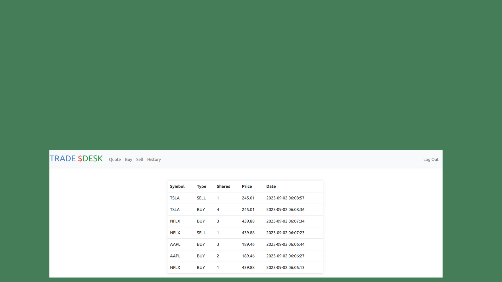

# Project Name

Brief project description goes here.

## Introduction

The Trade-desk App is a simple web-based application developed as part of the CS50 Web Programming with Python and JavaScript course. It simulates a stock trading platform where users can register, buy and sell stocks, view their transaction history, and check their account balance.

## Features

-User Registration: Users can create accounts with unique usernames and secure passwords.

- Stock Trading: Users can search for stocks, view their current prices, and buy/sell shares.
- Portfolio: Users can see their current portfolio, including stocks they own and their current values.
- Transaction History: A record of all user transactions is maintained for reference.
- Account Balance: Users can view their account balance and check their available funds.
- Real-Time Stock Data: Stock prices are fetched in real-time using an external API.

## Getting Started

Explain how to get started with your project. Include prerequisites, installation instructions, and any initial configuration steps.

### Prerequisites

Dependencies
Flask: Web application framework
SQLite: Database management
IEX Cloud API: Real-time stock data

### Installation

-Clone this repository to your local machine:
git clone [https://github.com/yourusername/cs50-trading-web-app.git]

-Install the required Python packages:
[pip install -r requirements.txt]
Set up your database by configuring config.py with your database credentials.

-Run the application:
flask run
Open your web browser and access the application at http://localhost:5000.

## Usage

- Register for an account or log in if you already have one.(username: manoj , password: a1@).
- Browse available stocks and their prices.
- Buy and sell stocks to build your portfolio.
- Monitor your transaction history and account balance.
- Log out when finished.

## Acknowledgments
This project was inspired by the CS50 Web Programming with Python and JavaScript course.
